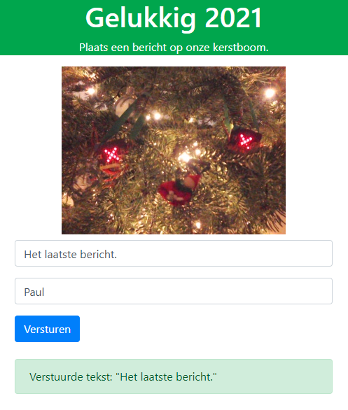

# Gelukkig 2021 (Happy 2021)

This is my 2020 Christmas holidays project. I used two [Micro:bit](https://microbit.org/) boards as Christmas decorations and send text messages over Bluetooth LE (max 20 characters) using a RPI zero. All was connected to the Internet using a docker container with [Traefik reverse proxy](https://traefik.io/) and a container running Nginx. The project used Python3 / Flask and Bootstrap4 / jQuery.

## Projects used

* [video streaming with Flask](http://blog.miguelgrinberg.com/post/video-streaming-with-flask)
* and its follow-up [Flask Video Streaming Revisited](http://blog.miguelgrinberg.com/post/flask-video-streaming-revisited)
* [Ajax/jQuery single page](https://www.youtube.com/watch?v=IZWtHsM3Y5A)

## Screenshots

